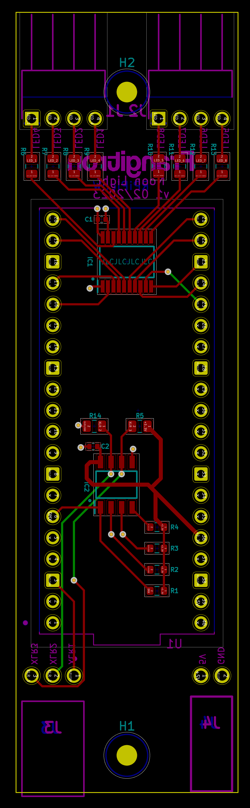

# Noon Light - PCB

Electronics for a RaspberryPico(W) based, LED Strip driving, DMX fixture

## Schematics

### PCB

| 3D front | 3D back | PCB |
|---|---|---|
|  |  |  |

## Links

-  https://electricfiredesign.com/2021/03/12/logic-level-shifters-for-driving-led-strips/
- https://www.theatrelightingworkshops.com/dmx-to-analog-conversion/
